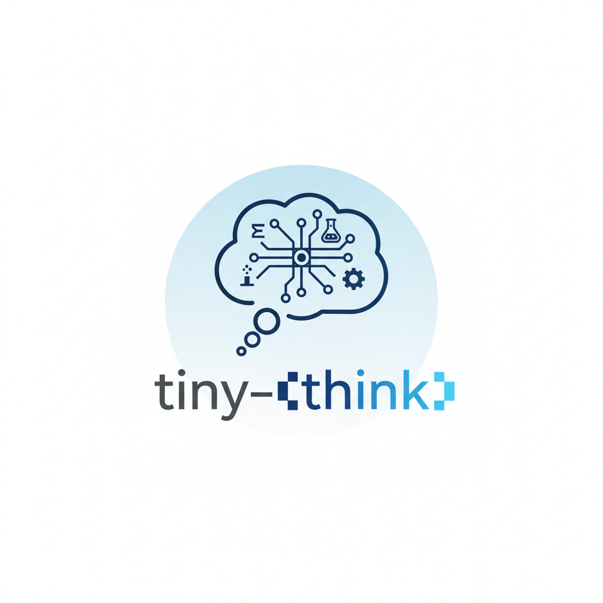

<p align="center">
  
</p>

<p align="center">
  <strong>Tiny Think</strong><br/>
  Reasoning-first post-training for tiny language models (140M) on a single GPU.
</p>

<p align="center">
  <!-- <a href="assets/paper.pdf">📄 <strong>Camera-Ready Paper</strong></a> &nbsp; | &nbsp; -->
  <a href="https://huggingface.co/collections/Shekswess/tiny-think">🤗 <strong>Hugging Face Collection</strong></a>
</p>

## About

**Tiny Think** is the official research codebase for:

> **Tiny Think: Reasoning-First Post-Training for Tiny Math and STEM Language Models**

This repository studies a simple question:

> **What does post-training actually do to reasoning in very small language models under strict hardware constraints?**

The project is intentionally:
- minimal
- reproducible
- runnable on a single consumer GPU

## Why This Repo Exists

Tiny models are attractive because they are cheap, fast, and practical to run locally. But once you push reasoning-style post-training into the `140M` regime, the behavior becomes less obvious:
- supervised fine-tuning can improve math behavior,
- preference optimization can further improve task-specific math accuracy,
- but those gains can come with regressions in broader reasoning and instruction following.

This repo exists to make that tradeoff concrete, reproducible, and easy to inspect.

## Headline Results

The main result is not just that post-training helps math, but that it can also introduce a measurable **general reasoning tax**.

| Checkpoint | GSM8K | BBH | IFEval | Interpretation |
| :--- | ---: | ---: | ---: | :--- |
| `SFT (NLL; epoch 2)` | `8.04` | `23.84` | `21.63` | Strongest balanced SFT checkpoint |
| `DPO (beta=1, lr=3e-6)` | `9.40` | `13.18` | `16.45` | Best GSM8K, but broad reasoning regresses |
| `APO-zero (beta=0.5, lr=3e-6)` | `8.26` | `12.01` | `16.08` | Similar tradeoff pattern under APO |

In other words:
- full fine-tuning at `140M` is enough to produce non-trivial math reasoning,
- preference optimization behaves more like **calibration** than free capability gain,
- math-only evaluation would miss important regressions.

## Artifacts

- Model collection: [Hugging Face Collection](https://huggingface.co/collections/Shekswess/tiny-think)
- Main SFT config: [`configs/sft/math_stem_nll_bf16.yaml`](configs/sft/math_stem_nll_bf16.yaml)
- Main DPO config: [`configs/dpo/math_stem_dpo_beta1_lr3e_6_e1_bs8.yaml`](configs/dpo/math_stem_dpo_beta1_lr3e_6_e1_bs8.yaml)
- Main APO config: [`configs/dpo/math_stem_apo_zero_beta0_5_lr3e_6_e1_bs8.yaml`](configs/dpo/math_stem_apo_zero_beta0_5_lr3e_6_e1_bs8.yaml)
- Evaluation entrypoint: [`eval/run_eval_vllm_multi.sh`](eval/run_eval_vllm_multi.sh)

## Experimental Scope

These constraints are deliberate:
- **Single machine only**
- **Single GPU** (`RTX 5060 Ti`, `16 GB` VRAM)
- **No distributed training**
- **No DeepSpeed / FSDP**
- **No LoRA / PEFT**
- **Full fine-tuning only**
- Base model fixed to `facebook/MobileLLM-R1-140M-base`

This is not a generic training framework. It is a controlled research repo for studying tiny-model post-training under tight resource limits.

## Training Overview

Tiny Think uses a simple two-stage post-training recipe:

**Stage A - Supervised Fine-Tuning (SFT)**
- math + STEM data with explicit `<think>` traces
- about `60M` tokens
- `NLL` or `DFT` objectives

**Stage B - Preference Optimization**
- math/STEM preference pairs
- about `10M` tokens
- `DPO` or `APO-zero`

Stage B improves solution selection, but it can also narrow behavior and hurt broader reasoning.

| Stage | Goal | Data Budget | Objective |
| :--- | :--- | :--- | :--- |
| `Stage A: SFT` | Teach structured reasoning traces in math/STEM | `60M` tokens | `NLL` or `DFT` |
| `Stage B: Preference` | Calibrate solution selection | `10M` tokens | `DPO` or `APO-zero` |

## Repository Layout

```text
assets/                # logo
configs/               # experiment configs
  sft/
  dpo/
data/                  # dataset download / preparation utilities
  sources/
train/                 # SFT and preference-optimization training entrypoints
eval/                  # vLLM + lm-eval evaluation entrypoints
```

## Quickstart

This repository uses **Python 3.12 + uv** and expects a local `.venv`.

### 1. Create or activate the environment

```bash
if [ -d ".venv" ]; then
  source .venv/bin/activate
else
  uv venv .venv --python=3.12 --seed
  source .venv/bin/activate
fi
```

### 2. Install dependencies in the required order

```bash
uv pip install "lm-eval[api]"
uv pip install langdetect immutabledict
uv pip install sympy math_verify antlr4-python3-runtime==4.11
uv pip install -U vllm --torch-backend=cu128
uv pip install trl
uv pip install liger-kernel
uv pip install kernels
uv pip install wandb
```

### 3. Inspect or prepare dataset sources

The datasets are derived from `allenai/Dolci-Think-SFT-7B` and `allenai/Dolci-Think-DPO-7B`. Repository utilities for source inspection and dataset preparation live under [`data/`](data/).

Examples:

```bash
python data/download_dolci_think_sft.py
python data/download_dolci_think_dpo.py
```

### 4. Run the main SFT stage

```bash
python train/sft.py --config-path configs/sft/math_stem_nll_bf16.yaml
```

### 5. Run the main DPO stage

```bash
python train/dpo.py --config-path configs/dpo/math_stem_dpo_beta1_lr3e_6_e1_bs8.yaml
```

### 6. Evaluate checkpoints

Full evaluation sweep:

```bash
./eval/run_eval_vllm_multi.sh
```

Paper-style math evaluation:

```bash
MODE=math_eval MODEL_ID=Shekswess/tiny-think-dpo-math-stem-dpo-beta1-lr3e-6-e1-bs8 ./eval/run_eval_vllm_multi.sh
```

## Evaluation

Evaluation uses:
- **vLLM** for inference
- **lm-eval** for benchmark execution

Benchmarks used include:
- `GSM8K`
- `MATH500`
- `BBH`
- `IFEval`
- STEM-oriented tasks such as `MMLU-STEM`, `ARC-Challenge`, `OpenBookQA`, `GPQA`, and `PIQA`

The evaluation scripts are designed to follow the same reasoning-oriented setup used in MobileLLM-R1.

## What This Repo Is And Is Not

This repo is:
- research code for controlled tiny-model post-training experiments
- optimized for local reproducibility on one consumer GPU
- focused on understanding tradeoffs, not just maximizing a single benchmark

This repo is not:
- a production system
- a general-purpose chatbot stack
- a distributed training framework
- a PEFT / LoRA benchmark suite

## Citation

If you use this repository, please cite.

```bibtex
@article{jakimovski2026tinythink,
  title={Tiny Think: Reasoning-First Post-Training for Tiny Math and STEM Language Models},
  author={Jakimovski, Bojan and Ilijoski, Bojan},
  year={2026}
}
```

## License

Apache-2.0. See [`LICENSE`](LICENSE).
